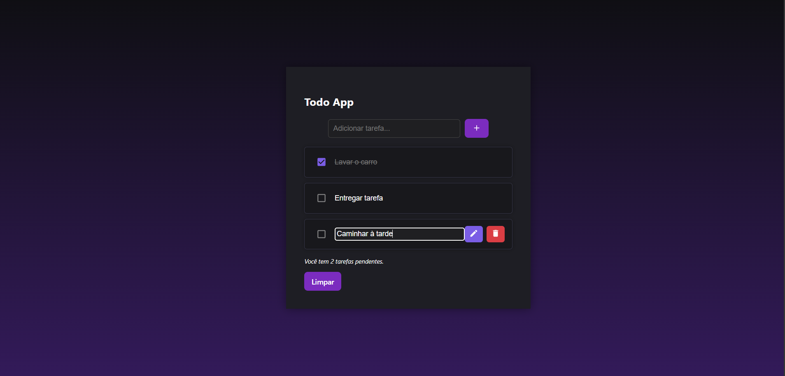

# 📋 Todo App — Gerenciador de Tarefas

Um aplicativo simples de lista de tarefas feito com **React Vite + TypeScript +**, com funcionalidades de adicionar, editar, marcar como concluída, remover e limpar tarefas — com persistência de dados no `localStorage`.



---

## 🚀 Funcionalidades

- ✅ Adicionar novas tarefas
- ✏️ Editar tarefas existentes
- ✔️ Marcar tarefas como concluídas
- 🗑️ Remover tarefas individualmente
- 🧹 Limpar todas as tarefas
- 💾 Salvar tarefas automaticamente no `localStorage`
- 🎨 Design responsivo com Material UI

---

## 🧱 Tecnologias utilizadas

- [React](https://react.dev/)
- [TypeScript](https://www.typescriptlang.org/)
- [Material UI](https://mui.com/)
- CSS Modules

---

## 📦 Como executar o projeto

```bash
# Clone o repositório
git clone https://github.com/seu-usuario/todo-app.git

# Acesse a pasta do projeto
cd todo-app

# Instale as dependências
npm install

# Inicie o servidor de desenvolvimento
npm run dev
```
